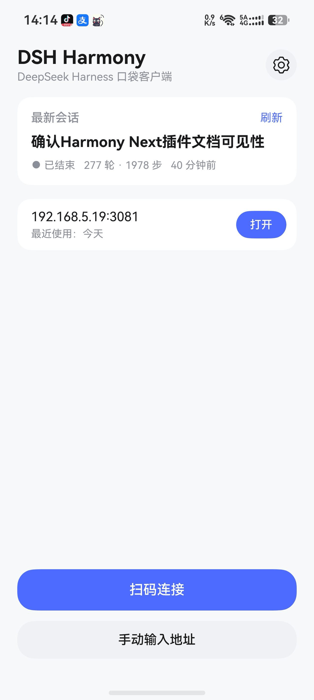
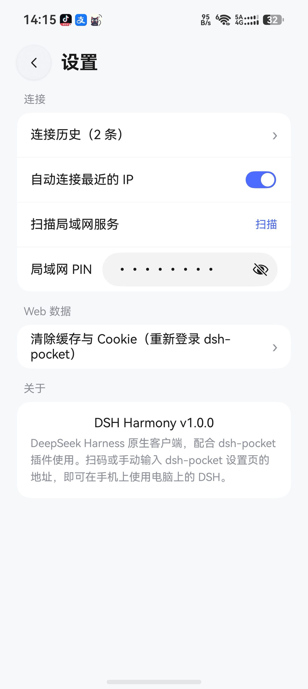
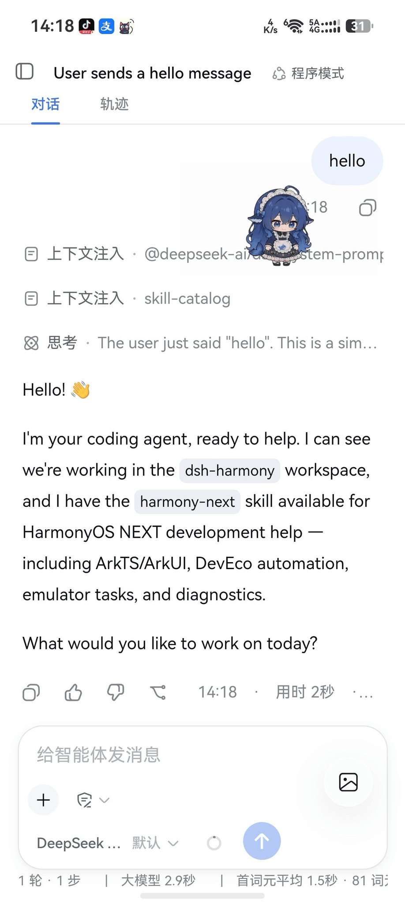

# DSH Harmony

A **native HarmonyOS client for DeepSeek Harness**, designed to work with the [dsh-pocket](https://github.com/shaobeichen/dsh-pocket) plugin: scan the QR code on your desktop DSH settings page and use DeepSeek Harness on your phone in real time.

> 📱 Target: HarmonyOS 7.0 (phones / foldables / tablets) · personal use, not planned for app-store release
> 🇨🇳 中文: [README.md](README.md)

## Features

- 📷 **Scan to connect**: custom immersive scanner (transparent status bar, WeChat-style gradient scan line, glass ×/flash buttons); scan → validate → open ArkWeb
- 🧭 **Connection history**: deduped by IP, newest first, swipe-to-delete, tap to open; manual URL input lives in Settings
- ⚡ **Auto-start console**: with the setting on, each app launch enters the console via the resolved available connection (LAN direct IP → public tunnel); if none works the home shows a persistent notice and offers to add one
- 💬 **Native session detail page**: from Latest session / Session list / widget — Markdown-rendered chat, message images, image sending, controls (pause/resume/stop/complete), a "thinking…" indicator and near-real-time refresh
- 🔀 **Auto connection switch**: the phone probes the LAN direct IP and the public tunnel and switches to whichever is reachable when the network changes (console / detail follow); when neither is reachable the home shows a persistent notice
- 📥 **Export auto-save**: session-log exports land in the phone's Downloads automatically (zero dialogs; under Downloads/com.dsh.lite/)
- ⚡ **Latest session at a glance**: home card and desktop widget show the latest session (title / running / turns / steps / relative time; title wraps, tap to refresh)
- 🖼 **Album image injection**: floating glass button → pick from album → auto-converted to JPEG and injected into the DSH composer (any phone format, chat with images directly)
- 🔔 **Push Kit (in progress)**: client Token fetch and desktop push service (tools/push-notify/) are ready; once AGC push is activated, task notifications arrive even in background/killed (design: docs/push-plan.md)

> 🔑 **AGC dependency setup (not committed; required before building)**: place the downloaded `agconnect-services.json` under `entry/src/main/resources/rawfile/`; AGC credentials (AppID/key) go into `tools/push-notify/.env` (real values never committed; see `.env.example`); release signing materials live in `certs/` (gitignored — private keys must never be pushed)
- 📇 **Service widget**: desktop widget shows connection status, last-used time and the latest session; tap to open DSH
- 🛡️ **Privacy-friendly**: only connection URLs are stored; PINs/credentials never persisted; one-tap clear for web data and history
- 🔧 **Full toolchain**: CLI build / on-device smoke tests / Hypium unit tests / GitHub Actions CI
## Screenshots

| Home (latest session / one-tap connect) | Settings (connection / web data) | Chat (agent conversation) |
| --- | --- | --- |
|  |  |  |

## How it works

```
DSH Harmony (ArkWeb)
   │  scan to get URL
   ▼
dsh-pocket proxy (desktop :3081) ── rewrites Host/Origin to loopback, bypassing the browser trust fence
   │  in-page 8-digit PIN auth (App not involved)
   ▼
DeepSeek Harness web (desktop :3080)
```

See the [dsh-pocket README](https://github.com/shaobeichen/dsh-pocket) for plugin installation and usage.

## Requirements

| Item | Requirement |
| --- | --- |
| OS | HarmonyOS 7.0 (exact API version per your phone's About screen) |
| Dev | DevEco Studio 26.0.0 Beta2 (hvigor / ohpm / hdc / HarmonyOS SDK 26) |
| Device | A HarmonyOS phone / foldable / tablet with USB debugging enabled |

> SDK config: `compileSdkVersion / targetSdkVersion = 26.0.0(26)` (SDK 26.0.0 Beta2 / API 26), `compatibleSdkVersion = 6.0.0(20)`.

## Quick start

1. Desktop: install the dsh-pocket plugin in DSH and open the "Phone access" settings page to get the QR code
2. Phone: install DSH Harmony (build locally or download a Release HAP; `hdc install -r` or local install)
3. Open the app → tap "Scan to connect" → scan the QR on your desktop screen → the DSH UI opens
4. Next time, pick a connection from history to go straight in; public connections require the 8-digit PIN inside the page

## Local development

```bash
./scripts/dev-tools.sh          # Detect DevEco/SDK/hvigor/ohpm/hdc paths
./scripts/build.sh              # Build debug HAP (output entry/build/.../*.hap)
./scripts/build.sh release      # Release build (unsigned)
./scripts/build.sh --install    # Build and install to the connected device
./scripts/smoke.sh              # On-device smoke: install→launch→UI check→log check→uninstall
./scripts/unit-test.sh          # Unit tests (device required; or run the Test config in DevEco)
./scripts/devecocli.sh          # DevEco CLI unified entry (toolchain/device/ui/docs/lint/mcp)
./scripts/ui-smoke.sh           # On-device UI smoke (devecocli ui layout assert + screenshot + logs)
./scripts/gen-changelog.sh      # Generate a per-day CHANGELOG section
```

Toolchain paths can be overridden via environment variables (`DEVECO_HOME` / `DEVECO_SDK_HOME` / `HVIGORW` / `OHPM` / `HDC`); CI must provide them explicitly.

### DevEco CLI / Code tooling (optional)

The project is wired to Huawei's official **DevEco CLI** (`devecocli`, `@deveco/deveco-cli@stable`) as a unified entry:

- `./scripts/devecocli.sh` auto-points the toolchain to the local **Command Line Tools 26.0.0.821** (Release) and DevEco Studio, then passes through `devecocli` subcommands.
- Useful: `--check-env`, `device list`, `ui screenshot|layout|click|swipe|text`, `log --level E`, `docs search|read` (offline docs), `check lint`, `check compat`, `signature generate`, `build/run`.
- `devecocli check lint` needs `code-linter.json5` (committed); `check compat` needs DevEco Studio.
- **Agent integration**: `./scripts/devecocli.sh --mcp` configures the `deveco-mcp` (`.ets`/C/C++ syntax check) into the project (writes `.mcp.json` / `.cursor/` / `.codex/`, all gitignored, regenerable); `./scripts/devecocli.sh --skill` installs the `deveco-cli` skill into supported agents.
- **DevEco Code** (`@deveco/deveco-code`, AI-agent tool `deveco`): if the local `~/.local` is root-owned and blocks its data dir, run `sudo chown -R $(whoami) ~/.local` or set `XDG_DATA_HOME/STATE_HOME/CACHE_HOME` to writable paths.

### Testing

- Unit tests (Hypium): `entry/src/test/` — URL validation and connection model serialization
- UI smoke (ohosTest): launch → assert home-screen elements
- On-device smoke: `scripts/smoke.sh` (uitest dumpLayout assertions + hilog error scan)

## Project layout

```
├── AppScope/              App-level config (bundleName: com.dsh.lite)
├── entry/                 Main module
│   └── src/main/ets/
│       ├── entryability/  EntryAbility (lifecycle)
│       ├── pages/         Index (entry) / WebShell (ArkWeb shell) / SettingsPage
│       ├── components/    Connection card, manual URL dialog
│       ├── common/        constants / utils / store
│       └── model/         Data models
├── entry/src/test/        Hypium unit tests
├── entry/src/ohosTest/    UI smoke tests
├── scripts/               Build / test / smoke / changelog helpers
├── .github/workflows/     CI (build + sign + release)
├── .agents/skills/        Local dev skill (coding/review standards; gitignored, private)
└── docs/                  Architecture and other docs
```

## CI (GitHub Actions)

- push / PR: ohpm install → assembleHap (debug), artifact upload
- tag `v*`: release build + signing (repository secrets) → GitHub Release
- Build env: Huawei official "HarmonyOS standalone command-line tools" (SDK bundled), auto-downloaded on ubuntu runners

**First-time CI setup — provide the toolchain package** (this repo distributes via GitHub Release; `CLT_URL` already configured):

| Option | Notes |
| --- | --- |
| Release distribution (current) | `gh release upload` the package to a Release; point `CLT_URL` at the asset URL |
| Huawei download-center direct link | paste in workflow_dispatch inputs, or set variable `CLT_URL` / `CLT_SHA256` |
| Local download | download package locally then upload to Release (GitHub 2GiB single-file cap; split if larger) |

Get the package from [Huawei Developer download center - Command Line Tools](https://developer.huawei.com/consumer/cn/download/command-line-tools-for-hmos) — choose **Linux x64** matching the project SDK (26.0.0 / API 26 Beta2).

Signing secrets: `SIGNING_KEY` (p12 base64) / `SIGNING_CERT` / `SIGNING_PROFILE` / `KEYSTORE_PASSWORD` / `KEY_PASSWORD` / `KEY_ALIAS`

## Changelog

Changes are recorded per day in [CHANGELOG.md](CHANGELOG.md); commit messages follow Conventional Commits prefixes (feat/fix/perf/docs/test/chore/refactor); use `scripts/gen-changelog.sh` to generate a day's section automatically.

## References

- [dsh-pocket](https://github.com/shaobeichen/dsh-pocket) — the server-side plugin this app pairs with
- [hongshuxifan321/dsh-mobile-app](https://github.com/hongshuxifan321/dsh-mobile-app) — a similar Android shell app (Basic Auth + Keystore storage; useful reference)
- [ohosvscode/harmony-next-pipeline](https://github.com/ohosvscode/harmony-next-pipeline) — CI build approach reference

## License

MIT
